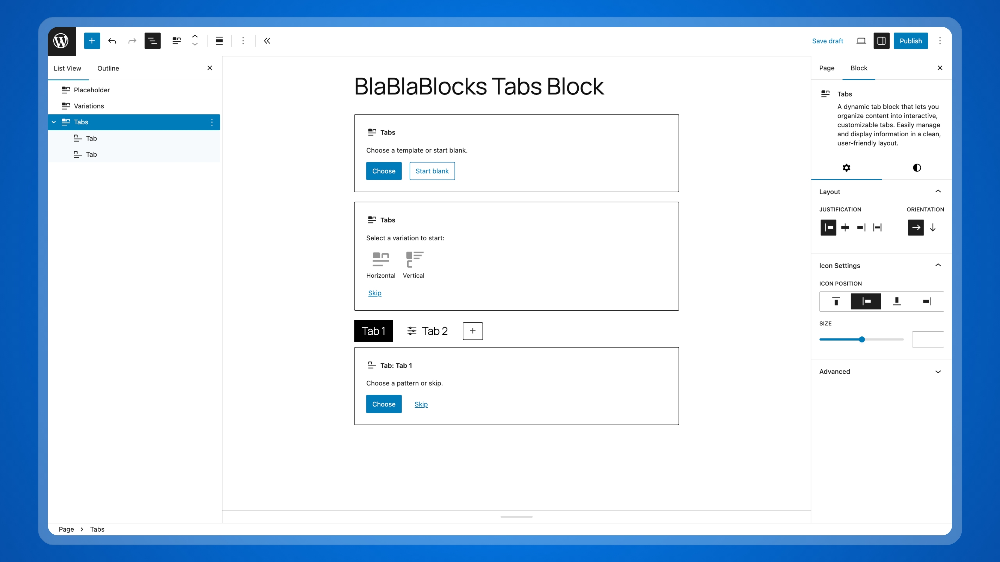

<p align="center"></p>



[](https://playground.wordpress.net/?blueprint-url=https://raw.githubusercontent.com/lubusIN/blablablocks-tabs-block/playground/_playground/blueprint-github.json)

## Overview

BlaBlaBlocks Tabs Block is a WordPress plugin built specifically for the Block Editor, allowing you to create responsive tabs effortlessly.

## Requirements

- WordPress 6.6+
- PHP 7.4+

## Installation

1. [Download](https://github.com/lubusIN/blablablocks-tabs-block/archive/refs/heads/dev.zip) latest copy from GitHub
2. Visit `Plugins > Add New`
3. Upload `blablablocks-tabs-block.zip` file
4. Activate `BlaBlaBlocks Tabs Block` from plugins page

## Development

### 1. Clone the Repository

Clone the repository to your local system:

```bash
git clone git@github.com:lubusIN/blablablocks-tabs-block.git
```

### 2. Go to plugin folder

```bash
cd blablablocks-tabs-block
```

### 3. Install Dependencies

```bash
npm install
```

### 4. Build Plugin

Build or start the development environment:

```bash
npm run build       # Compile the source files
# OR
npm run start       # Watch for changes and auto-compile
```

### 5. Launch Playground

Start a local WordPress playground using wp-now:

```bash
npx @wp-now/wp-now start
```

> [!NOTE]
> Refer to `package.json` for additional available npm commands.

## Meet Your Artisans

[LUBUS](http://lubus.in) is a web design agency based in Mumbai.

<a href="https://cal.com/lubus">

</a>

## License

BlaBlaBlocks Tabs Block is open-sourced plugin licensed under the [MIT license](LICENSE)
